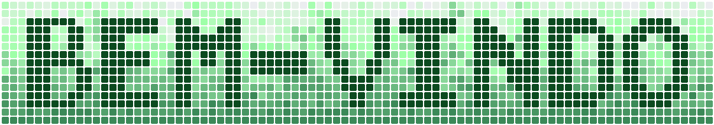

# 👋 Hello world!

👨‍💻 Desenvolvedor de Software &nbsp;|&nbsp; Quero melhorar o mundo *(nem que seja só um pouquinho)* através da Educação, Pesquisa e Desenvolvimento. &nbsp;

> Sou apenas um desenvolvedor de software apaixonado por entender como o universo funciona.  
> Meu objetivo é me divertir pesquisando e desenvolvendo soluções criativas para problemas do dia a dia, sejam eles complexos ou não.  
> Para tornar esses projetos possíveis utilizo uma base de ferramentas como: **C**, **Javascript/Typescript**, **Node**, **Git** e **IAs**.

 

### Boas vindas ao meu laboratório de projetos 🧪 

> Aqui você vai encontrar experimentos que envolvem Física, Química, Biologia, Eletrônica, projetos em evolução, códigos feitos com carinho e ~ideias que ainda estão tomando forma~   
> `// TODO: terminar esses projetos algum dia`.
>     
>  **Sinta-se em casa** 🏡

 

## O que estou desenvolvendo...

🔬 **[Firmware para Espectrofotometro](https://github.com/phtoselli/esp32-spectrophotometer-firmware)** &bull; Firmware em C de código aberto para um espectrofotômetro caseiro de baixo custo usando ESP32.

<!-- 
🧾 **[Nome Do Projeto](link)** &bull; Descrição do projeto.
--->

<!-- CONTEÚDO EXCLUIDO --->

<!-- 
## Minha caixa de ferramentas

--->

<!--
HERE A CODING GIF

-->

<!-- 
TABELINHA DE CÓDIGOS 
&#8203; - espaço de largura zero (invisível, útil para forçar pequenas quebras ou evitar colapso de linha)
&nbsp; - espaço não quebrável (impede que duas palavras se separem na quebra automática)
&thinsp; - espaço fino (menor que o espaço padrão)
&ensp; - espaço médio (aproximadamente equivalente a 2 espaços)
&emsp; - espaço largo (aproximadamente equivalente a 4 espaços)
&zwnj; - separador invisível (zero width non-joiner)
&zwj; - conector invisível (zero width joiner)
&mdash; - travessão tipográfico (—)
&bull; - marcador de lista personalizado (•)
--->
